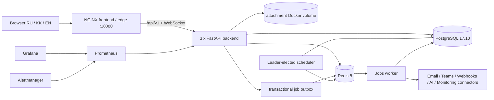

# SBS AI ITSM — Master System Document

**Статус документа:** evidence-based baseline, не заявление о production-ready  
**Дата аудита:** 2026-08-29; evidence обновлены 2026-08-30, Asia/Qyzylorda  
**Контур:** локальный production-like rehearsal `http://127.0.0.1:18080`  
**Источники истины:** код, PostgreSQL, FastAPI/OpenAPI, Docker runtime, браузер, полный regression и локальный release gate  
**Связанные документы:** [System Map](ITSM-SYSTEM-MAP.md), [Roadmap](ITSM-ROADMAP.md), [Backlog](ITSM-BACKLOG.md), [AI Context](ITSM-AI-CONTEXT.md)

## Правила чтения evidence

| Маркер | Что подтверждает |
|---|---|
| `CODE` | Реализация обнаружена в исполняемом коде release source |
| `DB` | Схема или данные подтверждены read-only запросом к локальной PostgreSQL |
| `API` | Маршрут обнаружен динамической introspection FastAPI/OpenAPI |
| `RUNTIME` | Сервис, health check или конфигурация подтверждены в работающем compose-контуре |
| `UI` | Экран проверен в реальном браузере с текущей ролью |
| `TEST` | Тест обнаружен/собран/выполнен; статус выполнения указан явно |

`IMPLEMENTED` означает наличие кода. `CONFIGURED` означает наличие runtime-конфигурации. `VERIFIED` означает фактическую проверку. Эти статусы не взаимозаменяемы.

# 1. Executive Summary

SBS AI ITSM сегодня — крупная модульная ITSM-платформа, а не прототип интерфейса: 216 PostgreSQL-таблиц, 621 OpenAPI path, 738 API-операций, 266 permission-кодов, 31 защищённый UI-маршрут и 891 собранный backend-тест. Реализованы Service Desk, requests, problem/change/release, CMDB/assets, SLA, knowledge, automation/workflow, AI governance/RAG/actions, integration platform, audit/security, tenant experience и production-like observability.

Gate 0 устранил два ранее подтверждённых дефекта: все ticket status mutations теперь проходят через один lifecycle service, а статический RU/KK/EN-контракт покрывает 4 562 из 4 562 видимых строк. Полный backend suite и локальный release gate прошли; production-like Docker runtime, финальная трёхъязычная browser-проверка, чистая миграция PostgreSQL 17 и clean provenance локального release source также подтверждены. Gate 0 = `PASS` на source commit `abbced1e02d5be5f4394d96847feceaa9157f56b`.

Этот локальный Gate 0 baseline всё ещё нельзя выпускать пользователям как доказанный production release. Главные причины:

- `P1/ACCEPTANCE`: текущая сессия не заменяет многоролевую read/write-приёмку admin/manager/agent/security/knowledge/requester на representative data.
- `P1/CONFIG`: OpenAI/Gemini, OIDC, внешняя доставка alerts, каталоги, SLA policies, workflow definitions и основные enterprise connectors в rehearsal не настроены и/или не наполнены.
- `P1/SERVER`: нет server TLS, external secrets/object storage, off-host DR, capacity/soak и актуального pentest evidence.

**Итоговый Go/No-Go для production: NO-GO.** Gate 0 даёт сильный локальный release baseline, но Gate 1+ и финальный server cutover остаются обязательными до запуска реальных пользователей.

# 2. Project Identity

| Поле | Фактическое значение | Evidence |
|---|---|---|
| Workspace | `C:\projects\sbs-ai-itsm-foundation-001` | CODE |
| Проект | `sbs-ai-itsm-backend` / `sbs-ai-itsm-frontend`, version `0.1.0` | CODE |
| Git branch | `main` | CODE |
| Audit start / release parent | `0b04ada23744349f565b44d60d52182da7f6da38` | CODE |
| Release source SHA / tree | `abbced1e02d5be5f4394d96847feceaa9157f56b` / `9d59a2c55027fc2d5d4de20e7a1667d0d9991b8d` | CODE |
| Release source commit date | `2026-08-30T01:16:29+05:00` | CODE |
| Origin | `https://github.com/Beibit-sbs/sbs-ai-itsm.git` | CODE |
| Release source delta | 705 paths: 548 added + 155 modified + 2 deleted; classes `383/68/88/164/2`; manifest SHA-256 `16246fb733d01eae10b37f0df39ca163c3225a2b0dc108a95b936c6f1856c3f4`; path SHA-256 `e0361c013cde6d68a4c9ec633b334ee22ba1d38b83226d8df7f80ad1062bae07` | CODE |
| Runtime environment | `APP_ENV=production`, `DEMO_MODE=false` | RUNTIME |
| Public local URL | `http://127.0.0.1:18080` | RUNTIME |
| DB migration | clean PostgreSQL 17 upgrade: 81 revisions, one head `20260829_0081`, 216 tables | DB/RUNTIME |

Вывод: воспроизводимый локальный release source зафиксирован и проверен. Push не выполнялся; remote CI/tag/signing и server release provenance остаются отдельными более поздними требованиями, а closure HEAD и финальный ignored-evidence hash фиксируются после closure commit в handoff без самоссылки в документе.

# 3. System Architecture

| Слой | Технология | Фактическое состояние |
|---|---|---|
| Frontend | React 19.2.7, TypeScript 6.0.3, Vite 8.1.3, React Router 7.18.2, TanStack Query 5.101.2, Tailwind 4.3.2 | Скомпилированный SPA обслуживается NGINX |
| Backend | Python 3.12+, FastAPI 0.139.0, SQLAlchemy 2.0.51, Alembic 1.18.5, Pydantic Settings 2.14.2 | 3 healthy replicas |
| Database | PostgreSQL 17.10 | 216 tables, migration head current |
| Queue/cache | Redis 8, AOF, noeviction | healthy; queue + realtime transport |
| Workers | Python worker + leader-elected scheduler | running; worker periodic cycles выключены compose override, scheduler включён |
| Files | Docker volume `/var/lib/sbs-ai-itsm/email-attachments` | single-cluster storage; не object storage |
| Observability | Prometheus 3.13.1, Alertmanager 0.33.1, Grafana 13.1.0 | running; внешние alert receivers не настроены |
| Edge | NGINX unprivileged, rate/connection limits, security headers | HTTP localhost; production требует внешний TLS proxy |

# 4. Module Map

| Домен | Backend/API | UI | DB | Статус |
|---|---|---|---|---|
| Identity/Auth | auth, MFA, sessions, OIDC, SCIM | Login, Account, Identity Provisioning | users, roles, auth_sessions, external_identities, MFA, provisioning | IMPLEMENTED; OIDC disabled |
| Service Desk | tickets, comments, history, bulk, participants, duplicate governance | Tickets | ticket_* | ACTIVE, requester verified |
| Major Incident | command workflow, updates, PIR, child incidents | Major Incidents | major_incident_* | IMPLEMENTED, no runtime records |
| Service Catalog | hierarchy, form versions, publication, personalization | Catalog | catalog_*, service_* | IMPLEMENTED, empty runtime catalog |
| Request Fulfillment | requests, RITM/tasks, approvals, SLA | Requests | service_requests, requested_items, fulfillment_tasks | IMPLEMENTED, empty runtime data |
| Problem/KEDB | lifecycle, RCA, known error, trends, corrective actions | Problems, Problem Governance | problem_* | IMPLEMENTED, empty runtime data |
| Change | RFC, approval, windows, tasks, PIR, standard models | Changes, Change Calendar | change_*, cab_*, standard_change_models | IMPLEMENTED, empty runtime data |
| Release | release records, packages, gates, deployments, decisions | Releases | release_* | IMPLEMENTED, empty runtime data |
| Assets/CMDB | asset lifecycle/import, CI classes, relationships, quality, reconciliation, impact | Assets | assets, asset_*, ci_*, cmdb_* | IMPLEMENTED, empty runtime data |
| Software Assets | products, licenses, installations, compliance | Software Assets | software_* | IMPLEMENTED, empty runtime data |
| SLA/OLA | policies, calendars, targets, instances, pause/timeline | SLA | sla_*, ticket_sla_* | IMPLEMENTED, no policies/instances |
| Knowledge | articles, feedback, usage, known errors, AI assist | Knowledge | knowledge_* | IMPLEMENTED, no articles |
| AI | provider, RAG, prompt/eval governance, runtime controls, guarded actions | Copilot + admin panels | ai_* | IMPLEMENTED; runtime mock, no AI records |
| Automation | rules/runs/actions, workflow designer/execution, runbooks | Automation | automation_*, workflow_*, runbook_* | IMPLEMENTED; no rules/workflows |
| Notifications | in-app, templates, preferences, email logs | Notifications, Email Log | notifications, notification_*, email_message_logs | PARTIAL ACTIVE; 21 notifications |
| Integrations | legacy adapters + production integration platform/webhooks | Integrations | integration_*, external_systems, outbound_webhook_* | IMPLEMENTED; no credentials/systems |
| Email/Teams | Microsoft Graph, inbound/outbound, attachments, Teams collaboration | Email Operations, Teams Collaboration | email_*, teams_* | IMPLEMENTED; not configured |
| Monitoring/Events | connectors, receipts, normalization, correlation/suppression | Monitoring, Event Operations | event_*, monitoring_* | IMPLEMENTED; no event sources |
| Search | global search + saved views + trigram indexes | global palette | saved_search_views + PostgreSQL indexes | IMPLEMENTED; requester UI works |
| Analytics/Reports | KPI endpoints, saved reports, snapshots, CSV/JSON | Dashboard, Analytics | saved_reports, report_snapshots | IMPLEMENTED; some demo naming remains |
| Admin/Configuration | tenants/users/roles/settings/security/config packages/custom fields | Admin, System, Data Governance, Custom Fields, Configuration Packages | configuration_*, custom_field_*, system_settings | IMPLEMENTED; representative Admin route VERIFIED in RU/KK/EN, full role matrix pending |
| Data Governance | retention, legal hold, deletion, evidence/export | Data Governance | data_* | IMPLEMENTED |
| Tenant Experience | branding, locale, localized content versions/review | shared shell/admin panels | tenant_experience_*, localized_content_* | IMPLEMENTED; static RU/KK/EN UI coverage VERIFIED 4 562/4 562 |

# 5. Functional Inventory

Фактически обнаружены следующие группы функций:

- учетные записи, tenant scope, local login, refresh rotation, session revoke, required password change, MFA TOTP/recovery, OIDC и SCIM foundation;
- 7 системных ролей, 266 permission-кодов, route-level и service-level authorization;
- очереди инцидентов, создание для себя/от имени, assignment, lifecycle, public/internal comments, history, participants/watchers, knowledge links, AI hints, bulk plan preview/apply, duplicate detection/dismiss/merge/split;
- catalog hierarchy, offering/item lifecycle, dynamic form schema/versioning, attachment rules, entitlements, publication/review, self-service preferences;
- service request/line item/task/approval/activity lifecycle;
- problem RCA, KEDB, corrective actions, trends и links;
- RFC types, risk, approvals, CAB/ECAB, windows/conflicts, implementation tasks, PIR, rollback evidence;
- release gates, packages, environments, deployments, decisions and timeline;
- asset import/lifecycle/history, CI class versions, relationships, reconciliation, quality/certification, impact analysis, discovery connectors;
- software product/license/installation compliance;
- business calendars, exceptions, policies, targets, SLA instances/pauses/events/timeline;
- articles/categories, feedback, usage, permission-aware visibility, ticket-to-KB flow;
- AI provider abstraction, PII policy, RAG, prompt version/review/eval/rollout, budgets/ledger/circuits, guarded propose/approve/execute/rollback;
- rule automation, workflow graph/version/review/publish/simulate/execute/retry/compensate/dead-letter, runbooks;
- in-app/email/Teams/webhook communication, templates/preferences, attachment quarantine and signed download;
- integration tokens/service accounts/mappings/webhooks/deliveries/replay/SDK contract;
- global search, saved/shareable views, analytics, report snapshots/export;
- tamper-evident audit chains, retention/legal hold/deletion evidence;
- operational health, metrics, dashboards, alerts, backups and restore tooling.

Статическая проверка нашла 681 `<button>` и 39 links; все имеют handler, form submission или destination. Это подтверждает wiring элементов, но не заменяет role-based mutation E2E.

# 6. Role Model

| Роль | Scope | Назначение | Distinct permissions | Runtime users |
|---|---|---|---:|---:|
| `saas_root` | global | управление платформой и всеми tenants | 266 | 1 |
| `organization_admin` | tenant | пользователи, роли, настройки и полный tenant control plane | 249 | 1 в основном tenant; duplicate role есть во втором tenant |
| `it_manager` | tenant | управление ITSM, аналитика, approvals, большинство операций | 208 | 0 |
| `it_agent` | tenant | Service Desk и операционное исполнение | 84 | 0 |
| `security_officer` | tenant | security/audit/data/integration monitoring | 84 | 0 |
| `knowledge_manager` | tenant | knowledge governance, RAG/read/search | 31 | 0 |
| `requester` | tenant | self-service portal и собственные обращения/запросы | 21 | 1 в текущем tenant; второй requester присутствует в rehearsal data |

DB содержит 13 role rows, потому что tenant-роли материализуются отдельно для tenants; логических кодов ролей семь.

# 7. Permission Matrix

Легенда: `A` — полный/platform; `M` — manage; `O` — operate; `R` — read/self-service; `S` — security governance; `—` — нет штатного доступа.

| Домен | Root | Org Admin | IT Manager | IT Agent | Security | Knowledge | Requester |
|---|---:|---:|---:|---:|---:|---:|---:|
| Tenant/users/roles/settings | A | M | limited | — | audit/read | translations | profile read |
| Tickets/incident | A | M | M | O | R | R | own R/create/comment/close/reopen |
| Major incidents | A | M | M | O/participate | R | — | — |
| Catalog/requests | A | M | M | O | R | — | self-service |
| Problem/change/release | A | M | M | O | R | problem/KB read | — |
| Assets/CMDB/SAM | A | M | M | O | R | — | — |
| SLA | A | M | R | — | — | — | — |
| Knowledge/RAG | A | M | M | O | R | M | published/RAG use |
| AI governance/actions | A | M | M | use/read | governance/read | RAG/manage KB | use/RAG |
| Automation/workflows | A | M | M | O | audit/read | — | — |
| Integrations/email/Teams | A | M | M | limited O | S/M | — | — |
| Analytics/reports | A | M | M | — | security analytics | — | — |
| Audit/security/data | A | M | limited read | — | S/M | — | — |

Точные permission-коды и присвоения находятся в `backend/app/services/seed.py`; runtime подтверждает totals `266/249/208/84/84/31/21`. UI route guards находятся в `frontend/src/auth/accessControl.ts`. Route authentication contract: 746 route entries, 739 protected, 7 explicitly governed public.

# 8. Business Processes

| Процесс | Ключевые состояния/переходы | Контроль | Оценка |
|---|---|---|---|
| Ticket | NEW → TRIAGE/ASSIGNED; ASSIGNED → IN_PROGRESS; WAITING_USER/WAITING_VENDOR; RESOLVED → CLOSED/REOPENED; governed CANCELLED | canonical service, row lock/version, scope, requester rules, audit, SLA, idempotency | Gate 0 lifecycle VERIFIED |
| Request | submit/approval/rejection → fulfillment → completed/cancelled; task OPEN/IN_PROGRESS/WAITING/COMPLETED/FAILED | approvals, activity, SLA | code complete, runtime empty |
| Catalog | DRAFT → IN_REVIEW → PUBLISHED → RETIRED | publication governance, form/version integrity | code complete, runtime empty |
| Problem | NEW → INVESTIGATING → ROOT_CAUSE_IDENTIFIED → KNOWN_ERROR/RESOLVED → CLOSED; reopen/retire/cancel | RCA/evidence/KEDB/links | code complete, runtime empty |
| Change | DRAFT/ASSESSMENT → approvals → SCHEDULED → IMPLEMENTING → completed/failed/rolled back/closed | risk, CAB, collision, tasks, PIR | code complete, runtime empty |
| Major Incident | DECLARED → MITIGATING ↔ MONITORING → RESOLVED → CLOSED; cancel | SEV, updates, actions, PIR required | code complete, runtime empty |
| Release | draft/readiness → gates/decision → deployment/validation → success/failure/rollback | linked changes, evidence, Go/No-Go | code complete, runtime empty |
| Asset/CI | discover/import → reconcile/review → assign/move/verify → dispose/restore; CI publish/version/certify | optimistic versioning, audit, quality | code complete, runtime empty |
| Knowledge | draft/review/publish/retire + feedback/usage | permissions, localized review, AI assist | code complete, runtime empty |
| Workflow | draft → review → publish → enqueue/run/wait/retry/compensate/terminal | four-eyes, hashes, idempotency; ticket mutations delegate to canonical service | engine rich; ticket transition integrity VERIFIED |
| AI action | propose → approve/reject → execute → rollback | four-eyes, policy, evidence, drift check | code complete, runtime empty |

# 9. Screen Inventory

В `App.tsx` 33 route declarations: login, 31 protected routes и wildcard fallback.

| Route | Экран | Requester browser result | Основные роли |
|---|---|---|---|
| `/login` | Login/MFA/SSO entry | не перезагружался, session already active | public governed |
| `/account` | профиль, пароль, MFA, sessions | VERIFIED | all authenticated |
| `/dashboard` | role-aware workspace/dashboard | VERIFIED | all authenticated |
| `/tickets` | Service Desk | VERIFIED | requester/agent/manager/admin |
| `/catalog` | service catalog | VERIFIED | requester + catalog roles |
| `/requests` | service requests | VERIFIED | requester/fulfillment roles |
| `/knowledge` | knowledge base | VERIFIED | authenticated per visibility |
| `/copilot` | AI Copilot/RAG | VERIFIED | AI permissions |
| `/notifications` | inbox/preferences/templates | VERIFIED | notification permissions |
| `/monitoring` | platform monitoring | ACCESS DENIED expected | admin/security |
| `/events` | event operations | ACCESS DENIED expected | monitoring roles |
| `/major-incidents` | major incident command | ACCESS DENIED expected | IT roles |
| `/changes` | RFC management | ACCESS DENIED expected | IT roles |
| `/change-calendar` | windows/CAB/governance | ACCESS DENIED expected | IT roles |
| `/releases` | release governance | ACCESS DENIED expected | IT roles |
| `/problems` | Problem/KEDB | ACCESS DENIED expected | IT/knowledge roles |
| `/problem-governance` | trends/corrective actions | ACCESS DENIED expected | IT roles |
| `/integrations` | adapters/control plane | ACCESS DENIED expected | integration/admin/security |
| `/assets` | assets + CMDB | ACCESS DENIED expected | asset/IT roles |
| `/software-assets` | software/license | ACCESS DENIED expected | SAM roles |
| `/sla` | SLA/OLA | ACCESS DENIED expected | SLA/admin roles |
| `/notifications/email-log` | email delivery log | ACCESS DENIED expected | communications/admin |
| `/analytics` | executive/operational analytics | ACCESS DENIED expected | manager/admin/security |
| `/automation` | rules/workflows/runbooks | ACCESS DENIED expected | automation/admin |
| `/admin` | users/roles/settings/audit/security | ACCESS DENIED expected | admin/root/security subsets |
| `/admin/system` | deep health/jobs/AI provider | ACCESS DENIED expected | admin/security |
| `/admin/data-governance` | retention/deletion/legal hold | ACCESS DENIED expected | data/admin/security |
| `/identity-provisioning` | SCIM/connectors/identities | ACCESS DENIED expected | identity/admin |
| `/email-operations` | Graph email/channels/quarantine | ACCESS DENIED expected | email/admin |
| `/teams-collaboration` | Teams connectors/deliveries/rooms | ACCESS DENIED expected | Teams/admin |
| `/admin/custom-fields` | form/custom field platform | ACCESS DENIED expected | config/admin |
| `/admin/configuration-packages` | config export/import/deploy | ACCESS DENIED expected | config/admin |

Браузерный проход: 8 рабочих requester-экранов, 23 корректных denied-экранов, console warnings/errors `0`.

# 10. API Inventory

Dynamic FastAPI evidence: 621 paths / 738 OpenAPI operations. Route-object contract включает 746 entries, поскольку служебные/non-schema routes считаются отдельно. По тегам:

| Tag | Ops | Tag | Ops | Tag | Ops |
|---|---:|---|---:|---|---:|
| system | 68 | tickets | 24 | admin | 29 |
| integrations | 38 | integration-platform | 22 | automation | 31 |
| workflow-engine | 27 | catalog | 26 | cmdb | 42 |
| changes | 7 | change-governance | 23 | releases | 23 |
| problems | 7 | problem-governance | 13 | requests | 13 |
| assets | 19 | asset-discovery | 11 | software-assets | 11 |
| sla | 20 | knowledge | 13 | notifications | 11 |
| ai | 7 | ai-rag | 7 | ai-governance | 14 |
| ai-runtime-controls | 6 | ai-actions | 7 | analytics | 10 |
| reports | 11 | security | 8 | auth | 17 |
| scim | 17 | identity-provisioning | 17 | email | 20 |
| teams | 13 | event-operations | 20 | major-incidents | 13 |
| configuration-center | 4 | configuration-packages | 17 | custom-fields | 18 |
| data-governance | 13 | global-search | 5 | localized-content | 6 |
| tenant-experience | 6 | tenants | 4 | monitoring | 1 |

Полный исполняемый inventory распределён по 51 route module в `backend/app/api/v1/routes`. Edge не публикует OpenAPI JSON: `/api/v1/openapi.json` возвращает 404, `/openapi.json` попадает в SPA. Для внешних интеграторов нужен versioned OpenAPI artifact/gateway route.

# 11. Database Model

PostgreSQL 17.10: 216 base tables, 718 indexes, 654 foreign keys, 149 unique constraints, 2 459 check constraints, 216 primary keys. 180 таблиц имеют `tenant_id`; PostgreSQL RLS policies: `0`, tenant isolation обеспечивается application-layer filters/RBAC.

Основные группы сущностей:

- identity: `tenants`, `users`, `roles`, `permissions`, `user_roles`, `role_permissions`, `auth_sessions`, `external_identities`, `user_mfa`, `mfa_login_challenges`, provisioning/SCIM tables;
- Service Desk: `tickets`, lookup/status/priority/category, comments, history, participants, governance actions, bulk plans, knowledge links, number counters;
- catalog/request: service categories/services/offerings/items/history/forms/preferences, service requests/requested items/approvals/tasks/activities;
- problem/change/release: problems/RCA/links/trends/corrective actions; change requests/approvals/windows/tasks/PIR/CAB/models; release records/gates/packages/dependencies/deployments/decisions/timeline;
- assets/CMDB/SAM: assets/types/assignments/history/import; CI classes/relationships/sources/reconciliation/impact/quality/certification; software products/licenses/installations;
- SLA: policies/calendars/exceptions/targets/instances/pauses/events/timeline;
- knowledge: articles/categories/feedback/usage/known-error usage;
- AI: suggestions, provider circuits, RAG documents/chunks/runs/query logs, data/prompt/evaluation/rollout policies, budgets/ledger, action policies/proposals/executions;
- automation: rules/runs/action logs, workflow definitions/versions/executions/steps/events/approvals, runbooks/executions;
- integrations/comms: external systems, credentials/mappings/logs, platform tokens/accounts/request logs/webhooks/deliveries, email and Teams tables;
- operations: job runs/outbox/lifecycle/events/consumer state, monitoring/event correlation, alerts/metrics/policy state;
- governance: system/configuration/custom-field/localization/tenant-experience revisions, data retention/deletion/legal hold/evidence, tamper-evident audit.

Фактические финальные rehearsal counts: 2 tenants, 7 users, 13 role rows, 266 permissions, 2 459 tickets, 22 799 audit events, 21 notifications, 9 job runs. Assets, articles, problems, changes, requests, catalog items, automation rules, workflow definitions, AI datasets/usage/actions, SLA policies/instances, integrations и event sources — `0`.

# 12. Service Desk

Реализованы requester/agent/manager queues, advanced filters/sort/paging, create for self/on behalf, assignment/self-assignment, lifecycle, comments, satisfaction/reopen, history, knowledge linking, participants/watchers, bulk preview/apply, similar-ticket scoring, false-positive governance, merge и split. Requester UI фактически показывает 21 open ticket и рабочую форму/quick templates.

Сильные стороны: optimistic/version controls, audit trail, tenant scope, permission-aware fields, SLA hints и последние production-oriented governance additions.

Пробелы: нет versioned macros/canned responses; routing skills/rosters не выделены как зрелый модуль; полный agent/manager E2E не выполнен. Ранее найденный workflow bypass canonical lifecycle устранён в Gate 0.

# 13. Incident Management

Базовый Incident реализован поверх Tickets. Major Incident имеет SEV1/SEV2 declaration, roles/participants, actions, stakeholder/public updates, child tickets, service status, mitigation/monitoring/resolution, обязательный approved PIR перед closure. Runtime major incidents отсутствуют, поэтому command-flow не принят на реальных данных.

# 14. Request Management

Catalog order создаёт request + requested items; есть sequential/parallel approval, entitlement/SLA snapshots, resubmit/cancel/comment, fulfillment tasks, assignment/evidence/status transitions и history. Runtime таблицы requests пусты, а каталог не наполнен — end-to-end submit→approve→fulfill пока не доказан.

# 15. Problem Management

Есть reactive/proactive problem, priority from impact/urgency, links to tickets/assets/changes, investigation/RCA/KEDB/resolution/closure, trends/corrective actions и governance screen. Runtime пуст; recurring-incident detection и KEDB effectiveness не подтверждены фактическими сценариями.

# 16. Change Management

Есть standard/normal/emergency RFC, risk, mandatory plans, approvals, CAB/ECAB agenda, windows/conflicts/blackouts, implementation tasks, asset/ticket links, validation/PIR and rollback outcomes. Runtime пуст; нет принятой университетской CAB-модели и календаря реальных change windows.

# 17. Release Management

Есть release records, semantic version fields, packages, environments, linked changes, gates/evidence, dependencies, decisions, deployments, validation/failure/rollback и timeline. Реальный CI/CD adapter не настроен; UI/runtime acceptance отсутствуют.

# 18. CMDB

Реализованы versioned CI classes, relationship types/graph, source identities, reconciliation and duplicate candidates, impact cache/assessment, quality findings/snapshots, ownership и certification. DB schema сильная, но без CI/relationships/sources нельзя доказать качество, topology и blast-radius analysis. PostgreSQL RLS отсутствует.

# 19. Asset Management

Есть inventory/import preview+commit, assign/move/verify/dispose/restore, history, discovery connectors/runs/stale candidates и SAM. В runtime assets = 0. Нет принятого network/IPAM/server discovery source; attachment/object storage и large-scale import acceptance не подтверждены.

# 20. Knowledge Management

Есть categories/articles/status/visibility, search, feedback, usage, ticket links, create-from-ticket, known errors, AI assistance и localized content review. Runtime articles = 0; editorial owners, seeded public content, deflection KPI и real RAG corpus отсутствуют.

# 21. Service Catalog

Есть category→service→offering→item hierarchy, lifecycle, owners, costs/risks, entitlements, approval/SLA policy snapshots, dynamic form versions и personalization. Runtime catalog items = 0, поэтому requester видит оболочку без production service portfolio. Университетские Platonus/Moodle/VPN/accounts/equipment services должны быть заведены как управляемые данные, не hardcoded demo actions.

# 22. SLA/OLA

Код поддерживает policies, targets, calendars, holidays, pauses, response/resolution deadlines, events/timeline, evaluation cycle и reporting. Runtime policies и ticket SLA instances = 0; текущий ticket UI использует SLA due/status hints, но enterprise SLA contract не настроен. Требуются business-approved priority matrix, calendars, escalation recipients and breach acceptance.

# 23. Automation

Legacy automation rules и новый workflow engine существуют параллельно. Workflow engine имеет graph schema, condition/action/wait/approval/subflow/end, version/review/publish, simulation, idempotency, retry/compensation/dead-letter и event hash chain. Runtime rules/workflows = 0.

Gate 0 вынес ticket lifecycle в `backend/app/services/ticket_lifecycle.py`. API patch/transition/assign/bulk, workflow, automation и event operations делегируют изменение статуса этому сервису. Он централизует matrix validation, authorization, row lock/optimistic version, timestamps, history, audit, SLA sync, notifications и deterministic idempotency; `OPEN/PENDING/WAITING` отклоняются, исторический alias ограничен `TRIAGED → TRIAGE`.

Canonical matrix: `NEW → TRIAGE | ASSIGNED | CANCELLED`; `TRIAGE → ASSIGNED | WAITING_USER | CANCELLED`; `ASSIGNED → IN_PROGRESS | WAITING_USER | WAITING_VENDOR`; `IN_PROGRESS → RESOLVED | WAITING_USER | WAITING_VENDOR`; `WAITING_USER → IN_PROGRESS | CANCELLED`; `WAITING_VENDOR → IN_PROGRESS`; `RESOLVED → CLOSED | REOPENED`; `CLOSED → REOPENED`; `REOPENED → TRIAGE | ASSIGNED`; `CANCELLED → ∅`.

# 24. AI

Уже существует:

- provider abstraction `mock/openai/gemini`, UI configuration/test/clear-secret;
- PII redaction/data policy and external-call gating;
- ticket analysis/suggestions;
- permission-aware RAG with source permissions, ingestion/query logs и prompt-injection patterns;
- prompt versions, datasets/cases/runs, four-eyes review, rollouts/canary/rollback;
- provider circuits, usage budgets/ledger;
- guarded actions propose/approve/reject/execute/rollback with drift evidence.

Фактический runtime: provider=`mock`, OpenAI key=false, Gemini key=false; AI suggestions/RAG documents/prompt versions/evaluation cases/usage/action proposals = 0. Значит AI foundation реализован, но production AI не подключён и не принят.

Целевая модель: AI Service Desk, Dispatcher, Incident Analyst, Knowledge Assistant, Problem Manager, Change Risk Analyst, CMDB Analyst, Infrastructure Analyst, Security Analyst и Director Assistant. Любой агент должен быть permission-aware, evidence-linked, budgeted, observable и human-governed; автономные destructive actions запрещены.

# 25. Notifications

Есть in-app events, preferences, templates, unread count, email logs, notification outbox integration, Teams и webhook delivery paths. 21 notification существует; templates = 0. Финальная диагностика: outbox `12/12` published, pending/failures/locked = `0`; deliveries `138/138` имеют статус `DELIVERED`; notification и automation consumers содержат по `69` delivered записей, а pending/failed у обоих равны `0`. Runtime SMTP/Slack/PagerDuty/custom alert webhook не настроены, поэтому internal delivery integrity подтверждена, но real external receiver acceptance ещё отсутствует.

# 26. Integrations

Production-oriented platform включает encrypted credentials, service accounts/tokens, allowlists, request logs, mappings, signed outbound webhooks, delivery/replay и connector contract. Отдельно есть Microsoft Graph email, Teams workflow webhook, monitoring connectors, OIDC и SCIM.

Legacy adapters `one_c/telegram/email/ldap/zimbra/platonus/moodle/custom_api/webhook/file_import` содержат mock/demo/simulation paths; при `DEMO_MODE=false` legacy demo operations блокируются. Runtime credentials/external systems = 0. Реальная интеграция отсутствует, несмотря на код.

# 27. Analytics

Dashboard и Analytics показывают ticket/SLA/assets/knowledge/AI/security/automation/executive metrics, saved reports, snapshots и CSV/JSON export. Панель руководителя уже покрывает volume, open/critical, SLA compliance/breaches, category/assignee load, security risk, automation и recommendations. Не покрыты доказанно network/server state, license exposure, real service health correlation и historical trend warehouse. В UI остаются `Demo export`, `Applied demo` и demo-derived KPI names — требуется очистка semantic debt.

# 28. Audit

Audit log tenant-scoped, содержит actor/action/entity/IP/user-agent/metadata, monotonic sequence, previous hash/event hash и separate chain heads. Read-only verification на финальной rehearsal БД: `valid=true`, 22 799 events, 3 chains, 0 failures. Это сильная сторона. Требуются external immutable retention/export и periodic verification alarm для server production.

# 29. Security

Подтверждены PBKDF2-SHA256 600k production hashes, password policy, short access/rotating refresh sessions, HttpOnly/Secure/Lax refresh cookie, revoke/replacement chain, login abuse controls, MFA encryption/TOTP/recovery, OIDC PKCE/nonce/asymmetric algorithm allowlist, SCIM rotating bearer tokens, RBAC, tenant filters, body/edge rate limits, security headers/CSP, secret files, read-only containers/cap-drop, CI dependency/image/secret scans и DAST workflow.

Ограничения: tenant isolation только application layer (RLS=0); OIDC off; production TLS находится вне compose; нет актуального external pentest/DAST evidence; локальный attachment volume не соответствует multi-node/immutable storage target.

# 30. Localization

`UI_LOCALES = ru-RU, kk-KZ, en-US`; locale-aware date/number/currency и tenant localized content lifecycle сохранены. Строгий audit `frontend/scripts/i18n-audit.mjs` проверяет структурный parity, placeholders/interpolation, literal usages, Cyrillic/mixed и Latin visible candidates и включён в CI.

Статический результат Gate 0: 1 020 сообщений, 183 explicit aliases, 2 693 direct source messages, 1 358 English source messages, 506 literal key usages и 335 literal translation usages. Audit проверил 93 file-local producer и 5 171 JSX expression; 4 562/4 562 видимых кандидатов разрешены, Cyrillic/mixed unresolved = `0/3 145`, Latin unresolved = `0/1 417`, critical/other = `0/0`; 194 allowlisted occurrence классифицированы как non-UI/proper noun/technical ID. RU/KK/EN source/UI contract — `VERIFIED`.

Подтверждённый browser evidence на финальном fresh build: семь критических маршрутов прошли в RU, KK и EN без alert; в EN на каждом из них обнаружено `0` Cyrillic UI strings. Ticket `SD-3409` прошёл создание и native required validation; в состоянии `NEW` backend-authoritative UI предлагал только `TRIAGE`, `ASSIGNED`, `CANCELLED`, после `NEW → CANCELLED` status dropdown исчез как для terminal state. Финальная history локализована в RU/EN/KK. RU-комментарий пользователя остаётся verbatim в EN/KK по дизайну; system mixed-language UI не обнаружен. Renderer исчерпывающе покрывает 27 текущих типов history events, AST validator проверяет восемь producer files, а user/external values никогда не переводятся.

# 31. Testing

| Evidence | Результат |
|---|---|
| Full backend suite | 891 collected / 875 passed / 16 skipped / 0 failed / 48 warnings in 1561.28 s; 88 files |
| Route auth contract | 746 total / 739 protected / 7 governed public, PASS |
| Ticket lifecycle | complete 10×10 matrix, negative/security/concurrency/idempotency regression, PASS |
| Local release gate | 28/28 PASS; clean provenance for source `abbced1e02d5be5f4394d96847feceaa9157f56b`; internal evidence SHA-256 `e0f788ade60439e75a6ff277d3d7c9e82762446f10457cd9662475806ccc13bd` |
| Clean migration | PostgreSQL 17, 81 revisions, one base/head `20260829_0081`, 216 tables, PASS |
| TypeScript / i18n | `tsc -b` PASS; RU/KK/EN 4 562/4 562; unresolved 0 |
| Static accessibility | 87 source files, 16 dialogs, 0 issues, PASS |
| Interactive controls | 681 buttons, 39 links, PASS |
| Production runtime smoke | 8/8 PASS: liveness/readiness/frontend/auth/metrics/Grafana/Alertmanager; 3 backend replicas healthy |
| Runtime lifecycle race | anonymous 401, invalid transition rejected, idempotent replay once, concurrent winner + 409 loser, final CLOSED |
| Browser lifecycle evidence | Seven critical routes × RU/KK/EN PASS/no alert; EN Cyrillic count 0; `SD-3409` create/validation/NEW actions/CANCELLED/final localized history PASS |
| Frontend unit/component/E2E runner | Not configured in package scripts; one TS test file exists but no active test command |

16 skips относятся к двум явно помеченным legacy contract suites Stage 026/027 (`7 + 9`); они рассмотрены и не скрывают failures текущего контракта. Production Docker build является authoritative frontend build; host-native Vite toolchain имеет известное environment-specific binding/spawn ограничение.

# 32. DevOps

Есть CI compose validation, backend lint/tests/migration graph, clean PostgreSQL migration, frontend build, pip/npm audits, Bandit, Trivy, Gitleaks; release workflow строит immutable images, scans, cosign/OIDC signatures, provenance attestations и release manifest; staging DAST использует OWASP ZAP baseline. Есть production preflight, smoke, tenant isolation, resilience, performance, authorization and release-gate scripts.

Локальный release gate прошёл `28/28`; `ruff`, compileall, TypeScript, i18n/a11y/controls, route auth, migration graph, compose и release validators прошли. Ignored source evidence имеет clean provenance для SHA `abbced1e02d5be5f4394d96847feceaa9157f56b`, четыре image digest и internal SHA-256 `e0f788ade60439e75a6ff277d3d7c9e82762446f10457cd9662475806ccc13bd`. Release delta содержит ровно 705 paths (`548 A / 155 M / 2 D`), manifest SHA-256 `16246fb733d01eae10b37f0df39ca163c3225a2b0dc108a95b936c6f1856c3f4` и path SHA-256 `e0361c013cde6d68a4c9ec633b334ee22ba1d38b83226d8df7f80ad1062bae07`; runtime/secret/operational data нет, credential-like matches ограничены fake test fixtures. Clean-HEAD `diff-check` PASS; parent-to-release scan имеет 121 P2 formatting finding только в Markdown (113) и versioned audit JSON (8), production-source findings = `0`. Gitleaks локально недоступен, хотя включён в CI; remote CI/tag/signing остаются требованиями Gate 8, а не блокером Gate 0.

# 33. Deployment

Compose содержит PostgreSQL, Redis, one-shot migration, 3 backend replicas, worker, scheduler, frontend/NGINX, Prometheus, Alertmanager и Grafana. Release-source production images собраны; frontend image `sha256:4f80d483ec1c01a8e86d65e995991c8b8853c20aa9f35b0097e2d05e3f1d2215`, 152 modules. Migrate завершился с кодом 0. Все containers healthy/running; readiness HTTP 200: postgres/redis/migrations/runtime/websocket all ready. Production smoke прошёл 8/8 checks: liveness, readiness, frontend, anonymous API denial, authenticated metrics, Grafana, Alertmanager и login/me/logout. В 3 087 runtime log lines обнаружено `0` errors и `0` HTTP 5xx. Transactional outbox: 12/12 published, pending/failures/locked = 0; deliveries: 138/138 `DELIVERED`; оба event consumer содержат по 69 delivered записей и имеют pending/failed = 0.

Есть encrypted DB + runtime-data backup/restore tooling, retention, alerting и runbook. В этом аудите destructive restore не выполнялся. Server cutover требует внешний TLS, DNS/certificates, secret manager, off-host backups/object storage, external receivers, load/capacity and rollback drill.

# 34. Known Problems

1. `P1` Нет полной многоролевой read/write browser acceptance на representative dataset.
2. `P1` Rehearsal не содержит representative data для catalog/request/problem/change/release/CMDB/SLA/AI/workflow/integrations.
3. `P1` External AI/identity/communications/integration providers не настроены.
4. `P1` Нет server TLS/object storage/off-host DR/load/soak/current pentest evidence.
5. `P2` Нет active frontend unit/component/E2E test runner.
6. `P2` 16 legacy Stage 026/027 contract tests обоснованно skipped, но требуют отдельного решения: migration/removal/replacement.
7. `P2` Production frontend main chunk `1 050.48 kB` (`289.17 kB` gzip) превышает порог Vite 500 kB и требует code splitting; отдельный Tickets chunk имеет `97.38 kB` (`20.97 kB` gzip).
8. `P2` Нет PostgreSQL RLS defense-in-depth.
9. `P2` OpenAPI spec не опубликован через edge как versioned artifact.
10. `P2` Attachment storage — локальный Docker volume.
11. `P2` Analytics содержит demo terminology/compat endpoints.
12. `P2` Parent-to-release formatting scan имеет 121 finding только в Markdown (113) и versioned audit JSON (8); production-source findings = 0, clean-HEAD gate проходит.

# 35. Technical Debt

- огромные route/page modules (`jobs.py` ~190 KB, `tickets.py` ~128 KB, `AdminPage.tsx` ~175 KB, `TicketsPage.tsx` ~163 KB, `AssetsPage.tsx` ~129 KB) повышают regression risk;
- legacy and new integration/automation surfaces сосуществуют;
- API schemas в основном inline в route modules; `app/schemas` содержит только минимальный слой;
- i18n catalog и explicit aliases крупные; строгий audit предотвращает drift, но нужна модульная ownership-модель переводов;
- часть UI/analytics labels всё ещё `demo/mock`;
- нет generated, diffable OpenAPI artifact и frontend contract generation;
- frontend production bundle требует route/module code splitting;
- application tenant filters требуют постоянного authorization contract discipline.

# 36. Missing Functionality

До универсальной университетской ITSM-платформы не хватает:

- versioned macros/canned responses, skill/roster-based routing and operational shift model;
- fully configured university service portfolio and approval chains;
- production network/IPAM/server/cloud discovery and topology;
- real software discovery/license reconciliation feeds;
- business-owned SLA/OLA calendars/escalations;
- Platonus/Moodle/LDAP/Zimbra/M365 adapters with live contracts, not mocks;
- governed RU/KK/EN business content для будущих catalog/knowledge/SLA records;
- real executive infrastructure/service health correlation;
- production AI corpus/evals/budgets/provider acceptance;
- E2E tests by role, browser, locale and critical workflow;
- server TLS/secrets/object storage/off-site backup/DR/load evidence.

# 37. Production Readiness

Процентная baseline-оценка больше не используется: Go/No-Go определяется по фактическим evidence-gates, а не по неподтверждённому агрегированному проценту.

| Область | Evidence status | Что остаётся |
|---|---|---|
| Ticket lifecycle | VERIFIED | расширять multi-role operational scenarios в Gate 1 |
| RU/KK/EN UI source contract | VERIFIED 4 562/4 562; seven routes × three locales PASS | full role matrix и будущий business content |
| Backend regression | VERIFIED 875 pass / 16 justified skips | решить судьбу legacy skipped suites |
| Local release source | VERIFIED — commit `abbced1e…`, 705-path manifest/path hashes | remote CI/tag/signing остаются Gate 8 |
| Local release gate | VERIFIED 28/28 — source-bound evidence `e0f788a…` | повторять после изменений |
| Clean DB migration | VERIFIED on PostgreSQL 17 | server migration/rollback rehearsal позже |
| Local Docker operations | VERIFIED healthy + smoke PASS | external TLS/secrets/storage/DR/load/on-call |
| Multi-role/business acceptance | NOT VERIFIED | Gate 1 и representative data |
| External providers/connectors | UNCONFIGURED | Gates 3, 6 и 7 |
| Server production cutover | NOT VERIFIED | Gate 8 |
| **Overall production** | **NO-GO** | Gate 1+ и server cutover остаются обязательными |

# 38. Development Roadmap

Gate 0 = `PASS`: локальный release source зафиксирован, классифицирован и связан с clean evidence/artifact manifest. **Gate 1: Multi-Role Representative Acceptance** — следующий разрешённый development gate, `NOT STARTED`. Затем: Service Desk productivity; live catalog/SLA; CMDB/discovery; enterprise integrations; AI activation; server production gate. Полные criteria находятся в `docs/ITSM-ROADMAP.md`.

# 39. Recommended Target Architecture

Сохраняется текущая модульная modular-monolith архитектура до появления измеримой причины разделения. Целевая server topology:

- external TLS ingress/WAF/load balancer → stateless frontend/backend replicas;
- managed/HA PostgreSQL with PITR, tested encrypted off-site backups;
- HA Redis with queue/stream durability and monitored consumer lag;
- S3-compatible immutable object storage with malware scanning/quarantine;
- worker pools separated by queue class and one leader scheduler;
- OIDC/SCIM corporate identity, university directory group mapping;
- connector gateway for M365/Graph, Platonus, Moodle, LDAP, monitoring, network/server/SAM discovery;
- OpenTelemetry/Prometheus/Grafana/Alertmanager with real on-call receivers;
- versioned OpenAPI/SDK, immutable signed images/SBOM/provenance;
- PostgreSQL RLS or equivalent defense-in-depth for critical tenant tables;
- centralized canonical lifecycle library used by UI/API/automation;
- key-based i18n with enforced 100% RU/KK/EN coverage;
- AI gateway with tenant data policy, redaction, budgets, eval gates, citations and human approval.

Для панели IT-директора целевой contract: ticket volume/open/critical/overdue, SLA/MTTA/MTTR, workload, service/server/network health, critical assets/licenses, changes/releases, security incidents, problematic departments, recurring incidents/root causes, trends and evidence-linked AI recommendations.

# 40. Final Verdict

Проект имеет сильную глубину и уже превосходит обычную MVP ITSM: schema/API/security/governance/operations foundation впечатляюще широки. Gate 0 подтвердил lifecycle integrity, полный статический и browser RU/KK/EN contract, regression, clean migration, production-like runtime и воспроизводимый локальный source provenance. На 2026-08-30 Gate 0 = `PASS`, а `REL-001` закрыт source commit `abbced1e02d5be5f4394d96847feceaa9157f56b` без push. Но полнота кода и локальный baseline не равны готовности к пользователям: система остаётся **production-capable foundation**, а overall production rollout = **NO-GO** до последующих gates.

**NEXT DEVELOPMENT GATE:** Gate 1 = `YES — next authorized gate, NOT STARTED`. Выполнить **Gate 1 — Multi-Role Representative Acceptance**: read/write journeys всех семи ролей, tenant isolation и representative ITSM dataset. Только после последующих domain/configuration/security gates подключать внешние providers и идти к server cutover.
